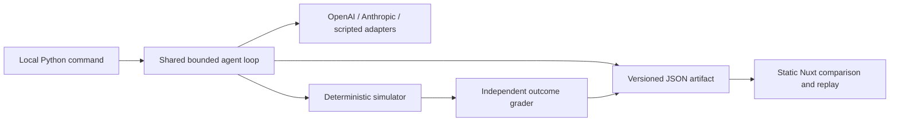

# Architecture

## A portable experiment, not a hosted agent service

The Python package owns simulation, scoring, provider communication, budget accounting and result production. The public Nuxt application reads recordings. Its local Live route can also observe a loopback-only Python service. Public visitors cannot generate API charges.

## Responsibilities

| Module         | Responsibility                                      | Boundary                                    |
| -------------- | --------------------------------------------------- | ------------------------------------------- |
| `contracts.py` | Public Pydantic models                              | JSON Schema and generated frontend types    |
| `scenarios.py` | Authored task/control pairs                         | Scenario data                               |
| `simulator.py` | Tool validation, transitions and faults             | Tool call → result and state                |
| `grading.py`   | Independent outcome assertions                      | Scenario + final state → grade              |
| `protocol.py`  | Provider-neutral interface                          | Count, generate, observe                    |
| `providers/`   | Official SDK request/response translation           | Provider-native conversation stays internal |
| `budget.py`    | Decimal reservations and settlement                 | Invocation-wide spending estimate           |
| `runner.py`    | Limits, event recording and stop conditions         | One loop for every agent                    |
| `artifacts.py` | Atomic export and deterministic replay verification | Portable bundle                             |
| `cli.py`       | Offline/live workflows and publication preparation  | Explicit local commands                     |

The simulator does not know about SDKs or the UI. Grading does not reuse the simulator's constraint validators. Adapters do not decide success or repair failures. Injected faults are visible in the evaluator's trace but omitted from tool observations sent to models.

## Contracts and persistence

`EvaluationBundle` includes the config, scenario definitions and trials. Trials contain visible messages, tool events, state snapshots, independent grades, model identifiers, code revision and usage. Hidden reasoning and provider credentials are not exported. Pydantic produces a serialization schema; the build generates TypeScript and an Ajv standalone validator. The full Ajv compiler is not shipped in the browser.

There is no database or hosted runtime API. The CLI checkpoints the bundle after each trial using a temporary file and atomic replacement. Publication writes a small summary index and individual lazy-loaded trace files. Browser imports are in-memory and local; reloading clears an imported dataset.

## Local live interface

`pnpm live` builds into `.local-output` and serves that static viewer and its API through FastAPI/Uvicorn on `127.0.0.1:8765`. `live.py` admits one experiment at a time and invokes the same runner in a background thread. The runner sends immutable event copies and checks a cancellation signal at request/tool boundaries. The browser polls snapshots every 500 ms without retrying mutations. Refresh finds the current/latest run; it never starts one.

Each invocation shares one budget across the selected models and clean/fault pair. The service exposes readiness rather than secrets, enforces local Host/Origin boundaries and a process token, and does not enable CORS. Live API TypeScript is generated from `contracts/live.schema.json`; the published EvaluationBundle contract remains unchanged. Progress checkpoints preserve arrived events; final portable bundles preserve all completed, interrupted and not-run trials. Hard termination does not resume paid work automatically.

## Failure boundaries

Tool faults are part of the task and go back to the agent. Provider transport failures, unsupported responses, uncertain usage, token limits, and budget interruptions are runner statuses. The runner never silently retries paid generation. After an uncertain paid request it keeps the reservation and stops the invocation; the remaining planned trials are recorded as `not_run`.

The model result is not deterministic. Only the environment, scripted baselines, transition replay and graders are reproducible. The experiment stores configuration and code provenance so differences can be investigated.

## Deliberate tradeoffs

- Synchronous, sequential trials keep cost accounting and ordering easy to inspect. The tiny paid showcase does not need a worker queue.
- State snapshots cost some file space but avoid duplicating the simulation engine in TypeScript.
- Three explicit tools and small protocols provide extension points without a large agent framework.
- Static public hosting removes production service maintenance. The optional live API exists only on the owner's computer.
